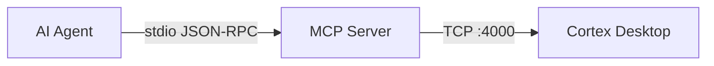

# MCP Server — Developer Guide

The Cortex IDE MCP (Model Context Protocol) server allows external AI agents to interact with the running IDE. Any MCP-compatible client (Cursor, Claude Code, Windsurf, custom agents, etc.) can use it to take screenshots, inspect the DOM, execute JavaScript, control windows, and more.

---

## Architecture



- **Transport**: stdio — the server reads JSON-RPC from stdin and writes responses to stdout
- **Backend connection**: TCP socket to `127.0.0.1:4000` where Cortex Desktop listens
- **Protocol**: [Model Context Protocol](https://modelcontextprotocol.io/) via `@modelcontextprotocol/sdk`
- **Validation**: All tool parameters are validated at runtime with [Zod](https://zod.dev/) schemas

---

## Prerequisites

| Tool | Version |
|------|---------|
| **Node.js** | >= 24.x |
| **npm** | >= 10.x |
| **Cortex Desktop** | Running (the MCP server connects to it via TCP) |

---

## Setup

```bash
cd mcp-server
npm install
```

---

## Running

### Development (with hot-reload via tsx)

```bash
npm run dev
```

### Production

```bash
npm run build    # Compile TypeScript → dist/
npm run start    # Run compiled server
```

### Direct execution

```bash
node dist/index.js
```

---

## Configuration

The socket client can be configured via environment variables:

| Variable | Default | Description |
|----------|---------|-------------|
| `CORTEX_MCP_HOST` | `127.0.0.1` | Host where Cortex Desktop's MCP socket is listening |
| `CORTEX_MCP_PORT` | `4000` | Port for the socket connection |

Example:

```bash
CORTEX_MCP_HOST=127.0.0.1 CORTEX_MCP_PORT=4000 npm run start
```

---

## Registering with AI Agents

### Cursor

Add to your Cursor MCP config (`.cursor/mcp.json` or global settings):

```json
{
  "mcpServers": {
    "cortex-desktop": {
      "command": "node",
      "args": ["/path/to/cortex-ide/mcp-server/dist/index.js"]
    }
  }
}
```

### Claude Code

```bash
claude mcp add cortex-desktop node /path/to/cortex-ide/mcp-server/dist/index.js
```

### Generic MCP Client

Any MCP client that supports stdio transport can launch the server:

```bash
node /path/to/cortex-ide/mcp-server/dist/index.js
```

The server communicates via stdin/stdout using JSON-RPC 2.0.

---

## Available Tools

### `ping`

Test connectivity to Cortex Desktop.

```
Parameters: none
```

### `take_screenshot`

Capture a screenshot of the Cortex Desktop window.

| Parameter | Type | Default | Description |
|-----------|------|---------|-------------|
| `windowLabel` | string | `"main"` | Window to capture |
| `quality` | number (1-100) | 75 | JPEG quality (lower = smaller file) |
| `maxWidth` | number | - | Max width in pixels, resized proportionally |

Returns an image (base64 JPEG) and dimensions.

### `get_dom`

Get the HTML DOM content from Cortex Desktop.

| Parameter | Type | Default | Description |
|-----------|------|---------|-------------|
| `windowLabel` | string | `"main"` | Window to query |
| `selector` | string | - | CSS selector for a specific element |

### `execute_js`

Execute JavaScript code in the Cortex Desktop webview.

| Parameter | Type | Default | Description |
|-----------|------|---------|-------------|
| `script` | string | *required* | JavaScript code to execute |
| `windowLabel` | string | `"main"` | Target window |

### `manage_window`

Control Cortex Desktop windows.

| Parameter | Type | Default | Description |
|-----------|------|---------|-------------|
| `operation` | string | *required* | `minimize`, `maximize`, `unmaximize`, `close`, `show`, `hide`, `focus`, `center`, `setPosition`, `setSize`, `toggleFullscreen` |
| `windowLabel` | string | `"main"` | Target window |
| `x` | number | - | X position (for `setPosition`) |
| `y` | number | - | Y position (for `setPosition`) |
| `width` | number | - | Width (for `setSize`) |
| `height` | number | - | Height (for `setSize`) |

### `text_input`

Simulate keyboard text input.

| Parameter | Type | Default | Description |
|-----------|------|---------|-------------|
| `text` | string | *required* | Text to type |
| `delayMs` | number | 20 | Delay between keystrokes (ms) |

### `mouse_action`

Simulate mouse actions.

| Parameter | Type | Default | Description |
|-----------|------|---------|-------------|
| `action` | string | *required* | `move`, `click`, `doubleClick`, `rightClick`, `scroll` |
| `x` | number | - | X coordinate |
| `y` | number | - | Y coordinate |
| `scrollX` | number | - | Horizontal scroll amount |
| `scrollY` | number | - | Vertical scroll amount |

### `local_storage`

Manage localStorage in Cortex Desktop.

| Parameter | Type | Default | Description |
|-----------|------|---------|-------------|
| `operation` | string | *required* | `get`, `set`, `remove`, `clear`, `keys` |
| `key` | string | - | Storage key |
| `value` | string | - | Value (for `set`) |
| `windowLabel` | string | `"main"` | Target window |

### `get_element_position`

Get the screen position and bounding rect of a DOM element.

| Parameter | Type | Default | Description |
|-----------|------|---------|-------------|
| `selector` | string | *required* | CSS selector |
| `windowLabel` | string | `"main"` | Target window |

### `send_text_to_element`

Focus a DOM element and send text to it.

| Parameter | Type | Default | Description |
|-----------|------|---------|-------------|
| `selector` | string | *required* | CSS selector |
| `text` | string | *required* | Text to send |
| `windowLabel` | string | `"main"` | Target window |

### `list_windows`

List all open windows in Cortex Desktop.

```
Parameters: none
```

---

## Output Truncation

All tool outputs support truncation to stay within AI agent context limits. The default configuration:

| Setting | Default | Description |
|---------|---------|-------------|
| `enabled` | `true` | Enable truncation |
| `maxLength` | `2000` | Maximum character length |
| `maxLines` | `100` | Maximum number of lines |
| `truncateMessage` | `"... [truncated]"` | Appended when output is truncated |

---

## Timeouts

Command-specific timeouts for the socket connection:

| Command | Timeout |
|---------|---------|
| `takeScreenshot` | 60s |
| `getDom` | 60s |
| `executeJs` | 60s |
| Default | 30s |

The socket client will automatically attempt up to 3 reconnections if the connection drops.

---

## Project Structure

```
mcp-server/
├── src/
│   ├── index.ts        # MCP server setup, tool definitions, stdio transport
│   └── client.ts       # CortexSocketClient — TCP socket connection to Cortex Desktop
├── dist/               # Compiled output (after npm run build)
├── package.json
└── tsconfig.json
```

---

## Development Rules

- **Never use `console.log`** — stdout is the MCP JSON-RPC transport. Use `console.error` for debug logging.
- **Server is stateless** — all state lives in Cortex Desktop. The MCP server is a pass-through.
- **All tool parameters must use Zod schemas** for runtime validation.
- **Respect truncation** to prevent context overflow in AI agents.
- **TypeScript strict mode** is enforced.

---

## Adding a New Tool

1. Define the tool in `registerTools()` in `src/index.ts`:

```typescript
server.tool(
  "my_tool_name",
  "Description of what the tool does",
  {
    param1: z.string().describe("Parameter description"),
    param2: z.number().optional().describe("Optional parameter"),
  },
  async (args) => {
    const response = await socketClient.sendCommand("myCommand", {
      param1: args.param1,
      param2: args.param2,
    });

    if (!response.success) {
      return {
        content: [{ type: "text", text: `Error: ${response.error}` }],
        isError: true,
      };
    }

    return {
      content: [{ type: "text", text: JSON.stringify(response.data, null, 2) }],
    };
  }
);
```

2. Ensure the corresponding command handler exists in Cortex Desktop's socket server (Rust backend).

3. Build and test:

```bash
npm run build
echo '{"jsonrpc":"2.0","id":1,"method":"tools/list"}' | node dist/index.js
```

---

## Troubleshooting

### "Connection refused" on startup

Cortex Desktop is not running or the socket server is not listening on port 4000. Start Cortex Desktop first, then launch the MCP server.

### Tool returns timeout error

The command-specific timeout was exceeded. For slow operations (screenshots, large DOM), the timeout is 60s. If Cortex Desktop is under heavy load, the response may take longer than expected.

### Unexpected timeout / socket reset

If a command times out, the MCP client now recycles the TCP connection before retrying future commands. This prevents late/stale responses from being matched to newer requests.

If you see repeated timeout or orphan-response logs, restart Cortex Desktop and confirm the MCP socket is reachable at the configured `CORTEX_MCP_HOST` / `CORTEX_MCP_PORT`.

### Agent can't find the MCP server

Make sure the path in your agent config points to the compiled `dist/index.js`, not `src/index.ts`. Run `npm run build` first.